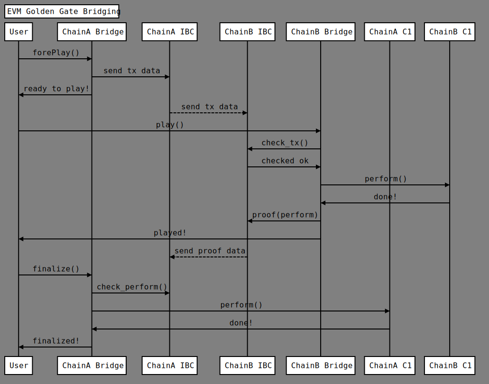
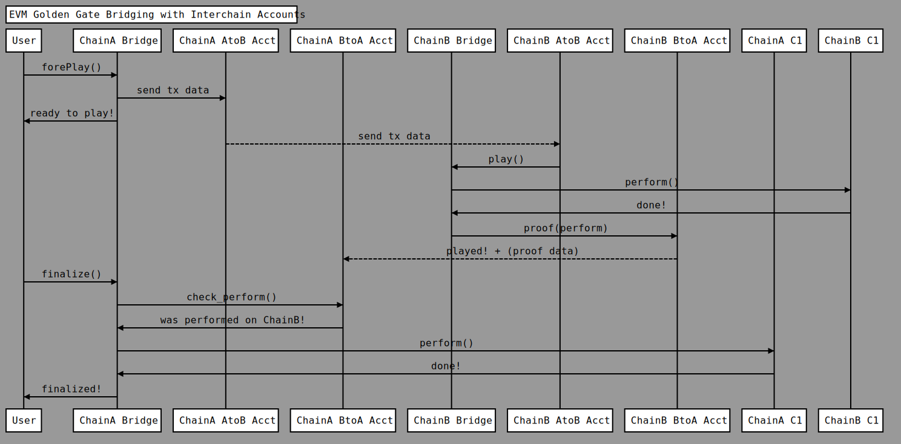

# Golden Gate Bridging by Replay

## Demos

https://youtu.be/ayFzY4btFX4

## Usecases

This bridge has the same usecases as the additional eth2 tech brings to eth1:

A set of EVM chains that use this bridge will become like a thick beacon chain (with behavior and data instead of the lean eth2 beacon), and the finality of tendermint may very well be faster than the one eth2 may adopt (they do not guarantee the "per block" finality yet and we do not know the period of block production).

- data shards - leave only the most used data on the main chain
- spawn rollups and sidechains with the same guarantees of compatibility and security as IBC, with their root state synchronized with the main chain
    - move data on a sidechain for high-throughput (think IoT or mass voting) and sync only the final data snapshot with the main chain
    - move rarely-used data on a sidechain and move it back on the main when you decide to use it more often
- all asset and token bridging that asset bridges can do with guarantees of asset unicity and integrity
    - with additional standardization, the replay mechanism can act as a correlated-action mechanism (e.g. lock-mint for tokens)
- this can be the backbone tech for data mirroring across chains (important data)
    - enforce typings across chains 
    - some chains will be more efficient than others at different operations - mirror data results from specialized chains to be accessed by any chain (think about CosmWasm engine vs EVM)


## Light Client

If the chain does not benefit from IBC, it needs a light client of each of the bridged chains.

## IBC

For EVM, an IBC precompile can play the role of a light client. Build order (on each chain):

- Singleton Factory
- Singleton Proxy with IBC semaphores
- Singleton ACL
- other singleton contracts (to be remotely played)

## Singleton Contracts

The transaction reply pattern can be implemented on EVM<->EVM bridge by using the same address of contracts and nonce synch across pairs of chains.
Such enforcing has to follow:

- controlled creation of contracts (eventually synchoronized creation)
- controlled nonce and order of synchronized transactions

## ACL Contracts

- for ensuring required balance / eventual slashing

## Proxy Contracts

- redirect transactions to the contracts where they need to execute
- maintain nonce sync or
- maintain state hash conform with "Abstracted Blockchains" theory

## IBC Precompile

- maintains one version of the state hash conform with "Abstracted Blockchains" theory

## ERC20, EIP721, Asset minting contracts

These contracts are not compatible directly with replay bridging, but they can become compatible by adapter contracts (that forward transactions).
Also replay-compatible protocols that correspond to these standards should be standardized (for gas saving).

### ERC20 -> ERC20-EGG

from https://eips.ethereum.org/EIPS/eip-20

All pure and view functions remain the same. Also the events:

- function name() public view returns (name: string)
- function symbol() public view returns (symbol: string)
- function decimals() public view returns (decimals: uint8)
- function totalSupply() public view returns (uint256)
- function balanceOf(address _owner) public view returns (uint256 balance)

- event Transfer(address indexed _from, address indexed _to, uint256 _value)
- event Approval(address indexed _owner, address indexed _spender, uint256 _value)

All mutable functions:

- function transfer(address _to, uint256 _value) public returns (bool success)
- function transferFrom(address _from, address _to, uint256 _value) public returns (bool success)
- function approve(address _spender, uint256 _value) public returns (bool success)
- function allowance(address _owner, address _spender) public view returns (uint256 remaining)

Become private and change their name to: _<function name> Example:

- function _transfer(address _to, uint256 _value) private returns (bool success)

The public mutable functions will be defined as:
  
```
function <function name>On(chain_ID, ...)...{
  uint256 chainID;
    assembly {
        chainID := chainid()
    }
  if (chainID == chain_ID) {
    _<function name>(...);
  }
}
```
Example:

```
function transferOn(uint chain_ID, address _to, uint256 _value) private returns (bool success){
  uint256 chainID;
  assembly {
      chainID := chainid()
  }
  if (chainID == chain_ID) {
    return _transfer(address _to, uint256 _value);
  }
  return 1;
}
  
```
  
In addition, we add a new function:
```
function transferTo(uint chain_ID, address _to, uint256 _value) private returns (bool success){
  _transfer( 0x0, _value);
  BridgeProxy.forePlay(encode(this.mintOn(chain_ID, _value)));
  return 1;
}
```
    
To make sure that a normal `mint` is never executed, we may blacklist that specific function signature from the Proxy Contract.
    
## Controls And Selectivity
    
- select functions by signature
- select the calling (sender) address (contract or EOA) by using ACL or proxy of proxy
- filter the contracts that accept calls by listing them or bloom filter
    

## Diagram
  

```
Title: EVM Golden Gate Bridging
participant User
participant ChainA Bridge
participant ChainA IBC

participant ChainB IBC
participant ChainB Bridge
participant ChainA C1
participant ChainB C1

User->ChainA Bridge: forePlay()
ChainA Bridge-> ChainA IBC: send tx data 
ChainA Bridge->User: ready to play!
ChainA IBC-->ChainB IBC: send tx data
User->ChainB Bridge: play()
ChainB Bridge->ChainB IBC: check_tx()
ChainB IBC->ChainB Bridge: checked ok
ChainB Bridge->ChainB C1: perform()
ChainB C1->ChainB Bridge: done!
ChainB Bridge->ChainB IBC: proof(perform)
ChainB Bridge->User: played!
ChainB IBC-->ChainA IBC: send proof data
User->ChainA Bridge: finalize()
ChainA Bridge->ChainA IBC: check_perform()
ChainA Bridge->ChainA C1: perform()
ChainA C1->ChainA Bridge: done!
ChainA Bridge->User: finalized!
  
```
    
## By Replay with Interchain Accounts
    

    
```
    Title: EVM Golden Gate Bridging with Interchain Accounts
participant User
participant ChainA Bridge
participant ChainA AtoB Acct
participant ChainA BtoA Acct


participant ChainB Bridge
participant ChainB AtoB Acct
participant ChainB BtoA Acct

participant ChainA C1
participant ChainB C1

User->ChainA Bridge: forePlay()
ChainA Bridge-> ChainA AtoB Acct: send tx data 
ChainA Bridge->User: ready to play!
ChainA AtoB Acct-->ChainB AtoB Acct: send tx data
ChainB AtoB Acct->ChainB Bridge: play()
ChainB Bridge->ChainB C1: perform()
ChainB C1->ChainB Bridge: done!
ChainB Bridge->ChainB BtoA Acct: proof(perform)
ChainB BtoA Acct-->ChainA BtoA Acct: played! + (proof data)
User->ChainA Bridge: finalize()
ChainA Bridge->ChainA BtoA Acct: check_perform()
ChainA BtoA Acct->ChainA Bridge: was performed on ChainB!
ChainA Bridge->ChainA C1: perform()
ChainA C1->ChainA Bridge: done!
ChainA Bridge->User: finalized!
    
```
