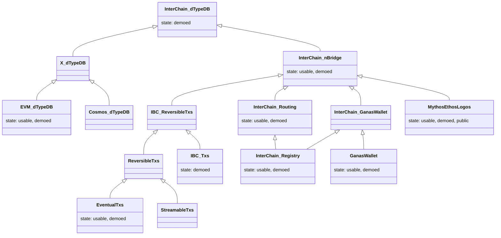
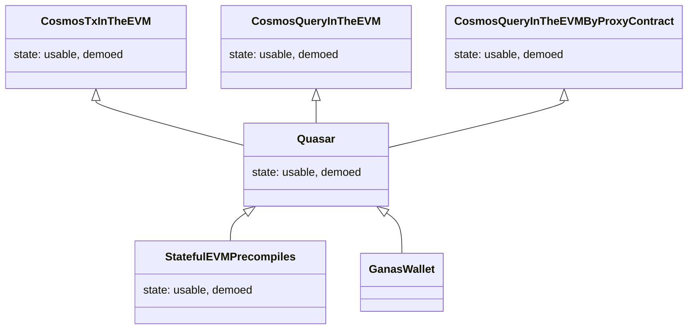
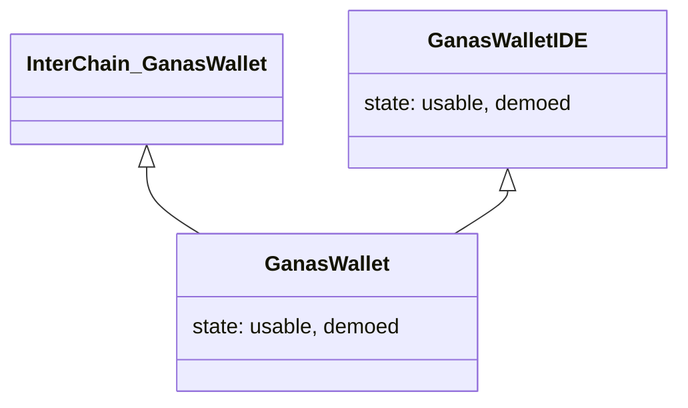

# Dependencies

(Click each node for details)

## InterChain dType DB

```mermaid
%%{init: {'securityLevel': 'strict'}}%%

classDiagram

InterChain_ dType DB <|-- InterChain_ nBridge
InterChain_ dType DB <|-- X_ dType DB

X_ dType DB <|-- EVM_ dType DB
X_ dType DB <|-- Cosmos_ dType DB

InterChain_ nBridge <|-- IBC_ Reversible Txs
InterChain_ nBridge <|-- InterChain_ Ganas Wallet

IBC_ Reversible Txs <|-- Reversible Txs
IBC_ Reversible Txs <|-- IBC_ Txs
Reversible Txs <|-- Eventual Txs
Reversible Txs <|-- Streamable Txs

InterChain_ nBridge <|-- InterChain_ Routing
InterChain_ Routing <|-- InterChain_ Registry
InterChain_ nBridge <|-- Mythos Ethos Logos

InterChain_ Ganas Wallet <|-- InterChain_ Registry
InterChain_ Ganas Wallet <|-- Ganas Wallet

class Mythos Ethos Logos {
    state: usable, demoed, public
}

class InterChain_ Routing {
    state: usable, demoed
}

class InterChain_ Registry {
    state: usable, demoed
}

class Eventual Txs  {
    state: usable, demoed
}

class IBC_ Txs  {
    state: demoed
}

class Ganas Wallet  {
    state: usable, demoed
}

class EVM_ dType DB  {
    state: usable, demoed
}

class InterChain_ dType DB  {
    state: demoed
}

class InterChain_ nBridge {
    state: usable, demoed
}

link InterChain_ dType DB "https://github.com/pipeos-one/goldengate/blob/master/research/Cosmos_EVM_Ideas_and_Prototypes.md#the-inter-chain-evm-contracts-dtypedb-the-inter-chain-database--demo-1"

link InterChain_ nBridge "https://github.com/pipeos-one/goldengate/blob/master/research/Cosmos_EVM_Ideas_and_Prototypes.md#the-nbridge---a-golden-gate-bridge-application"

link Ganas Wallet "https://github.com/pipeos-one/goldengate/blob/master/research/Cosmos_EVM_Ideas_and_Prototypes.md#ganas-a-wallet-for-the-inter-chain-the-concert-ganas-web---ganasx---ganas-mobile"

link InterChain_ Ganas Wallet "https://github.com/pipeos-one/goldengate/blob/master/research/Cosmos_EVM_Ideas_and_Prototypes.md#ganas-a-wallet-for-the-inter-chain-testing-releases"

link Eventual Txs "https://github.com/pipeos-one/goldengate/blob/master/research/Cosmos_EVM_Ideas_and_Prototypes.md#eventual-transactions---expanding-the-blockchain-limits"

link IBC_ Txs "https://github.com/pipeos-one/goldengate/blob/master/research/Cosmos_EVM_Ideas_and_Prototypes.md#ethereum-precompiles-proposals---inter-blockchain-communication-ibc"

link EVM_ dType DB "https://github.com/pipeos-one/goldengate/blob/master/research/Cosmos_EVM_Ideas_and_Prototypes.md#the-decentralized-database-ddb---on-the-ethereum-virtual-machine-evm"

link InterChain_ Routing "https://github.com/pipeos-one/goldengate/blob/master/research/Cosmos_EVM_Ideas_and_Prototypes.md#the-nbridge---a-golden-gate-bridge-application"

link InterChain_ Registry "https://github.com/pipeos-one/goldengate/blob/master/research/Cosmos_EVM_Ideas_and_Prototypes.md#the-nbridge---a-golden-gate-bridge-application"

link Mythos Ethos Logos "https://github.com/pipeos-one/goldengate/blob/master/research/Cosmos_EVM_Ideas_and_Prototypes.md#the-nbridge---a-golden-gate-bridge-application"


```

## Quasar

```mermaid
%%{init: {'securityLevel': 'strict'}}%%
classDiagram

class Quasar {
    state: usable, demoed
}

class Stateful EVM Precompiles {
    state: usable, demoed
}

class Cosmos Tx In The EVM {
    state: usable, demoed
}

class Cosmos Query In The EVM {
    state: usable, demoed
}

class Cosmos Query In The EVM By Proxy Contract {
    state: usable, demoed
}

Quasar <|-- Stateful EVM Precompiles
Quasar <|-- Ganas Wallet
Cosmos Tx In The EVM <|-- Quasar
Cosmos Query In The EVM <|-- Quasar
Cosmos Query In The EVM By Proxy Contract <|-- Quasar

link Quasar "https://github.com/pipeos-one/goldengate/blob/master/research/Cosmos_EVM_Ideas_and_Prototypes.md#quasar-execute-cosmos-transactions-from-an-evm-contract-eg-multisig"

link Stateful EVM Precompiles "https://github.com/pipeos-one/goldengate/blob/master/research/Cosmos_EVM_Ideas_and_Prototypes.md#quasar-execute-cosmos-transactions-from-an-evm-contract-eg-multisig"

link Cosmos Tx In The EVM "https://github.com/pipeos-one/goldengate/blob/master/research/Cosmos_EVM_Ideas_and_Prototypes.md#quasar---control-your-cosmos-evmos"
link Cosmos Query In The EVM "https://github.com/pipeos-one/goldengate/blob/master/research/Cosmos_EVM_Ideas_and_Prototypes.md#quasar-execute-cosmos-queries-from-the-evm-with-ganas-built-on-ethermintevmos"
link Cosmos Query In The EVM By Proxy Contract "https://github.com/pipeos-one/goldengate/blob/master/research/Cosmos_EVM_Ideas_and_Prototypes.md#quasar-execute-cosmos-transactions-from-an-evm-contract-eg-multisig"


```

## Ganas Wallet

```mermaid
%%{init: {'securityLevel': 'strict'}}%%

classDiagram
class Ganas Wallet  {
    state: usable, demoed
  
}
link Ganas Wallet "https://www.youtube.com/playlist?list=PL323JufuD9JCJy4i21fUatsDxAP8fENuK" 

InterChain_ Ganas Wallet <|-- Ganas Wallet

Ganas Wallet IDE <|-- Ganas Wallet
class Ganas Wallet IDE  {
    state: usable, demoed
  
}
link Ganas Wallet IDE "https://github.com/pipeos-one/goldengate/blob/master/research/Cosmos_EVM_Ideas_and_Prototypes.md#ganas-a-wallet-for-the-inter-chain-part-1-ide"

link InterChain_ Ganas Wallet "https://github.com/pipeos-one/goldengate/blob/master/research/Cosmos_EVM_Ideas_and_Prototypes.md#ganas-a-wallet-for-the-inter-chain-testing-releases"


```

## Stateful EVM Precompiles

```mermaid
%%{init: {'securityLevel': 'strict'}}%%
classDiagram

class Precompile_ Gas Refill  {
    state: usable, demoed
  
}

class Cron Txs  {
    state: usable, demoed
}

class EVM Interpreter  {
    state: usable, demoed
}

class IBC Precompile  {
    state: usable, demoed
}

class IPFS Precompile  {
    state: usable, demoed
}

class IPLD Precompile  {
    state: usable, demoed
}

class Merkle Proof {
    state: usable, demoed
}

class Introspection {
    state: usable, demoed
}

class Quasar {
    state: usable, demoed
}

Cron Txs <|-- Stateful EVM Precompiles
Precompile_ Gas Refill <|-- Stateful EVM Precompiles
EVM Interpreter <|-- Stateful EVM Precompiles
IBC Precompile <|-- Stateful EVM Precompiles
IPFS Precompile <|-- Stateful EVM Precompiles
IPLD Precompile <|-- IPFS Precompile
Merkle Proof <|-- Introspection
Introspection <|-- Stateful EVM Precompiles
Quasar <|-- Stateful EVM Precompiles

link Stateful EVM Precompiles "https://www.youtube.com/playlist?list=PL323JufuD9JDuDH9pWD7e-cVA623vRkXl"

link Precompile_ Gas Refill "https://github.com/pipeos-one/goldengate/blob/master/research/Cosmos_EVM_Ideas_and_Prototypes.md#gas-refill-precompile---prepay-ethereum-vm-transactions" 

link Cron Txs "https://github.com/pipeos-one/goldengate/blob/master/research/Cosmos_EVM_Ideas_and_Prototypes.md#cron-transactions-precompile-for-the-evm---cronjobs-for-the-blockchain-demoed-on-ethermint"

link EVM Interpreter "https://github.com/pipeos-one/goldengate/blob/master/research/Cosmos_EVM_Ideas_and_Prototypes.md#the-evm-interpreter-precompile"
link IBC Precompile "https://github.com/pipeos-one/goldengate/blob/master/research/Cosmos_EVM_Ideas_and_Prototypes.md#ethereum-precompiles-proposals---inter-blockchain-communication-ibc"
link IPFS Precompile "https://github.com/pipeos-one/goldengate/blob/master/research/Cosmos_EVM_Ideas_and_Prototypes.md#ethereum-precompile-proposals---ipfs-interplanetary-filesystem-eip"
link IPLD Precompile "https://github.com/pipeos-one/goldengate/blob/master/research/Cosmos_EVM_Ideas_and_Prototypes.md#ethereum-precompiles-proposals---ipld-interplanetary-linked-data-eip"
link Merkle Proof "https://github.com/pipeos-one/goldengate/blob/master/research/Cosmos_EVM_Ideas_and_Prototypes.md#ethereum-precompiles-proposals---on-chain-proof-creation-eip"
link Introspection "https://github.com/pipeos-one/goldengate/blob/master/research/Cosmos_EVM_Ideas_and_Prototypes.md#ethereum-precompile-proposals---introspection-eip"
link Quasar "https://github.com/pipeos-one/goldengate/blob/master/research/Cosmos_EVM_Ideas_and_Prototypes.md#quasar---control-your-cosmos-evmos"


```

