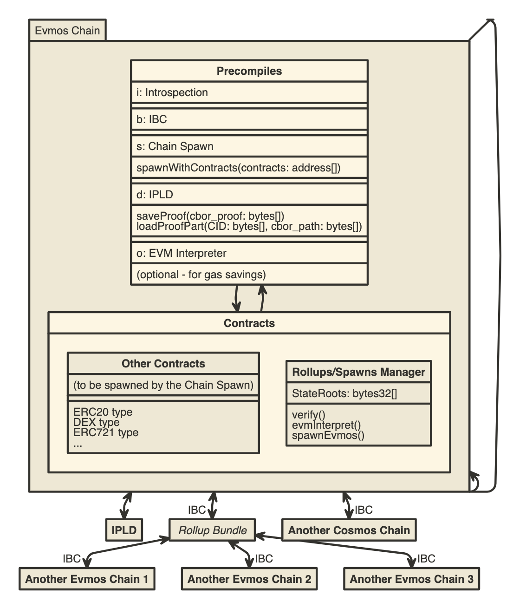

# EVM Rollups

By implementing the following precompiles:

- introspection (demo: https://youtu.be/cR4tUl0Kzq8, https://github.com/loredanacirstea/go-ethereum/tree/precompiles-test)
- Merkle Proofs (demo: https://youtu.be/VVNXztcXXFo, https://github.com/loredanacirstea/go-ethereum/tree/precompiles-merkle-proofs)
- IPFS (demo: https://youtu.be/Yaf3uLNWDwg, https://github.com/loredanacirstea/go-ethereum/tree/precompile-ipfs2)
- IPLD (demo: https://youtu.be/8M8Q5iO1cZ8, https://github.com/loredanacirstea/go-ethereum/tree/precompiles-ipld2)
- IBC (Cosmos' InterBlockchain Communication)

and behavior from:

- dTypeDB
- EVM Interpreter in EVM (demo https://youtu.be/gjxz1jzyQQM)

any EVM-based system can have rollups almost "for free" (as implementation effort). Plus it may combine the scaling economies of:

- rollups
- plasma-like execution chains
- data sharding

all into a single implemented solution.

An EVM-based chain with PoS (like Evmos https://github.com/tharsis/evmos) could be a settlement chain for spawned rollup-like chains based on Evmos (without the consensus layer, e.g. with a sequencer-like system). Data verification & availability is done on IPFS/IPLD (which have the awesome feature that you can republish data under the same CID at any time).

If the IBC precompile works as intended, you can have trust-minimized rollups bridging with the Cosmos ecosystem.

And a trust-minimized bridge Evmos <-> Ethereum would make economic sense, to back up this rollup system.
Other data-availability layers can be supported, but it is not a neccessity.




```

[Evmos Chain] -> Introspection [Evmos Chain]
[<package> Evmos Chain|
	[Precompiles |
    	i: Introspection ||
        b: IBC ||
        s: Chain Spawn |
        spawnWithContracts(contracts: address\[\])
        ||
        d: IPLD|
        saveProof(cbor_proof: bytes\[\])
        loadProofPart(CID: bytes\[\], cbor_path: bytes\[\]) ||
        o: EVM Interpreter|
        (optional - for gas savings)
    ] -> [Contracts |
    	[Rollups/Spawns Manager |
        	StateRoots: bytes32\[\]
            |
            verify()
            evmInterpret()
            spawnEvmos()
        ]
        [Other Contracts |
        	(to be spawned by the Chain Spawn) ||
            ERC20 type
            DEX type
            ERC721 type
            ...
        ]
    ]
    [Contracts] -> [Precompiles]
] <-> [IPLD]

[Evmos Chain] <-> IBC [<abstract> Rollup Bundle]
[Evmos Chain] <-> IBC [Another Cosmos Chain]


[Rollup Bundle] <-> IBC [Another Evmos Chain 1]
[Rollup Bundle] <-> IBC [Another Evmos Chain 2]
[Rollup Bundle] <-> IBC [Another Evmos Chain 3]


```

## Computing Efficiency

Instead of having general (unspecialiased) subchains, we should prefer dedicated decentralized services for:

- file storage: IPFS
- data storage: IPLD
- data indexing, data search: any good distributed and decentralized database. Maybe YugaByte.
- Read/Write speed: Redis or in-memory DB
- compute: Golem? any other decentralized CPU/GPU farm?
- communication, networking: Ark app, p2plib, WebRTC
