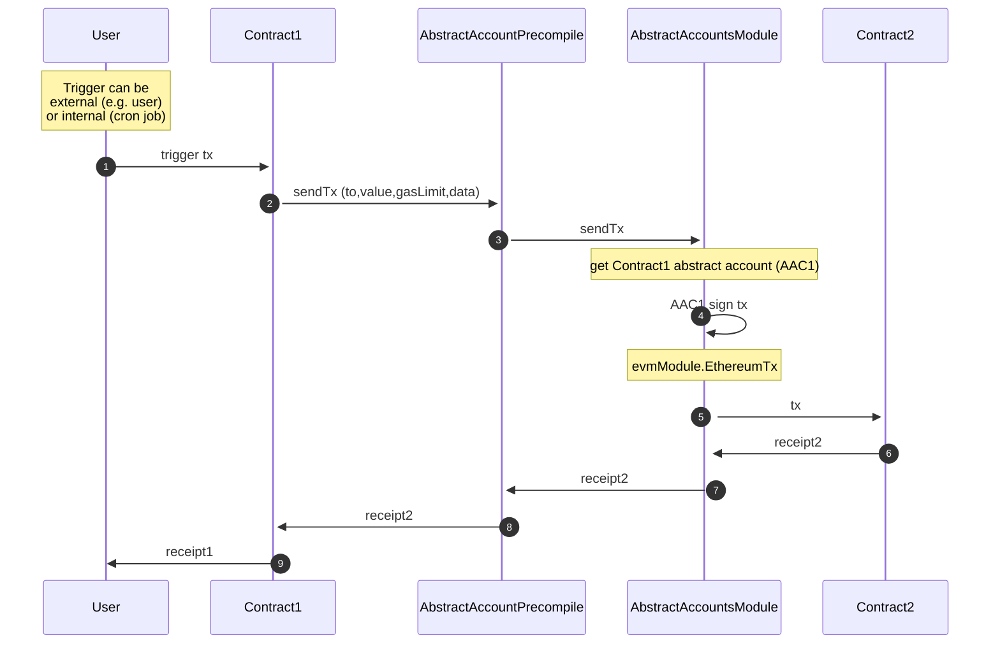

# Abstract Accounts

```mermaid
sequenceDiagram
    autonumber
    participant User
    participant Contract1
    participant AbstractAccountPrecompile
    participant AbstractAccountsModule
    %% participant Contract1AbstractAccount
    participant Contract2
    Note over User: Trigger can be<br>external (e.g. user)<br>or internal (cron job)
    User->>+Contract1: trigger tx
    Contract1->>+AbstractAccountPrecompile: sendTx (to,value,gasLimit,data)
    AbstractAccountPrecompile->>+AbstractAccountsModule: sendTx
    Note over AbstractAccountsModule: get Contract1 abstract account (AAC1)
    AbstractAccountsModule->>+AbstractAccountsModule: AAC1 sign tx
    Note over AbstractAccountsModule: evmModule.EthereumTx
    AbstractAccountsModule->>+Contract2: tx
    Contract2->>+AbstractAccountsModule: receipt2
    AbstractAccountsModule->>+AbstractAccountPrecompile: receipt2
    AbstractAccountPrecompile->>+Contract1: receipt2
    Contract1->>User: receipt1

```

## References

- https://eips.ethereum.org/EIPS/eip-4337
- https://eips.ethereum.org/EIPS/eip-2938
- https://github.com/ethereum/EIPs/issues/86
