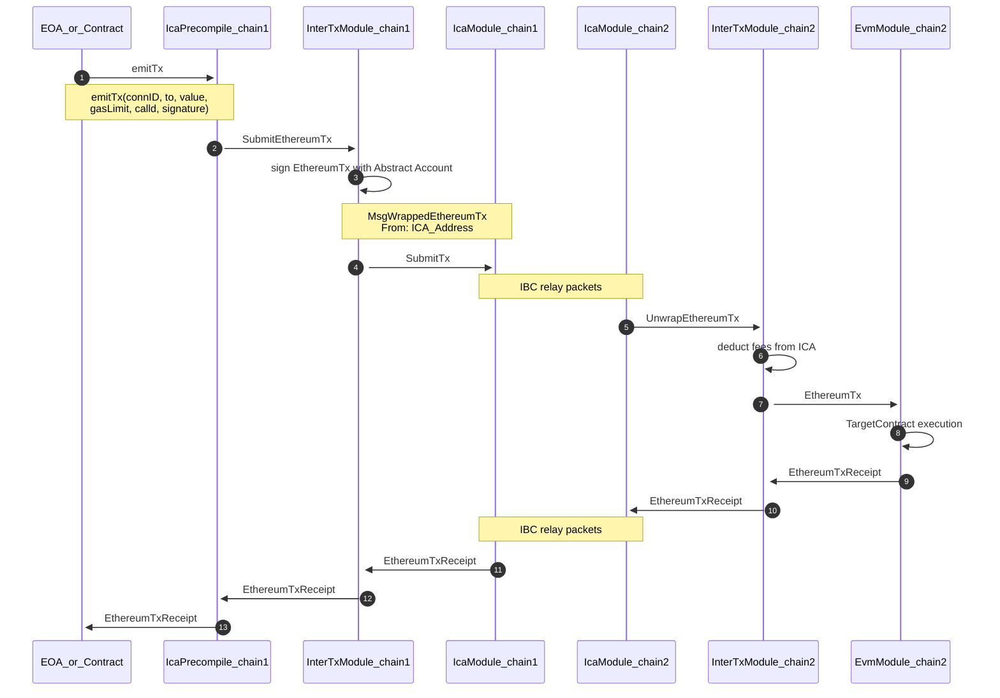

# Generalized State Bridge Between Cosmos-EVM Chains

This is an original idea for bridging Cosmos Chains with EVM enabled. Based on Cosmos [InterChain Accounts](./cosmos/InterChainAccounts.md) and our own flavour of (original idea) [Abstract Accounts](./cosmos/AbstractAccounts.md) (abstract programmatic accounts).

