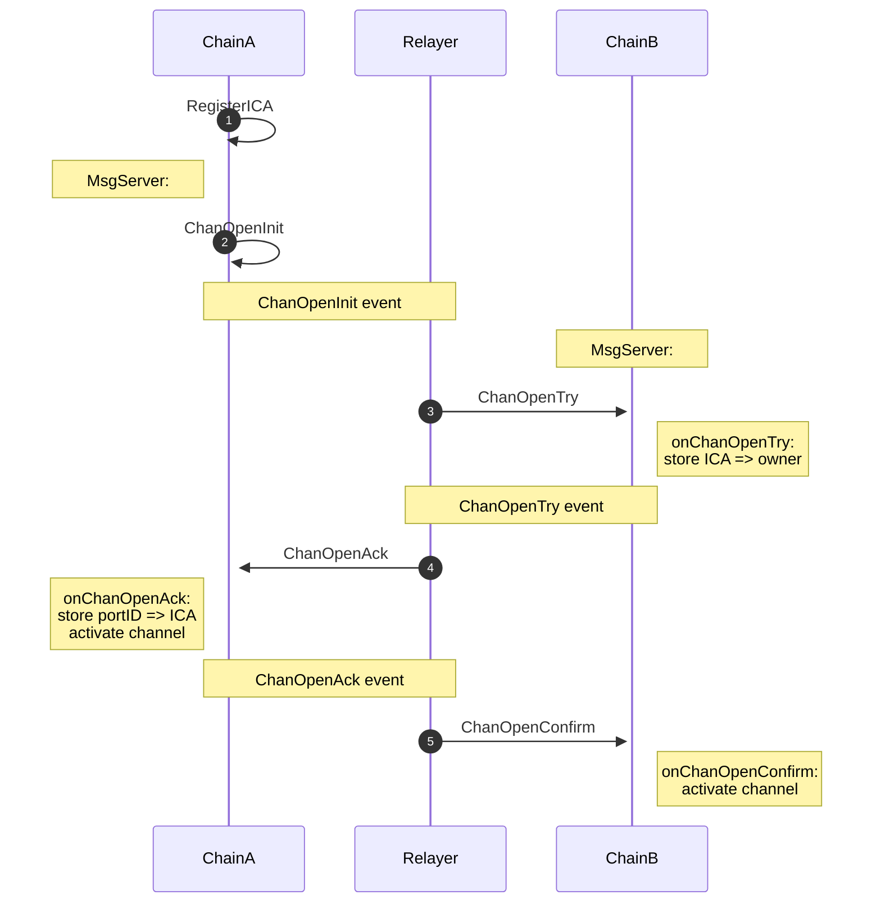

# Cosmos InterChain Accounts

Spec: https://github.com/cosmos/ibc/blob/52a9094a5bc8c5275e25c19d0b2d9e6fd80ba31c/spec/app/ics-027-interchain-accounts/README.md#identifer-formats

## ICA Registration Mechanism

